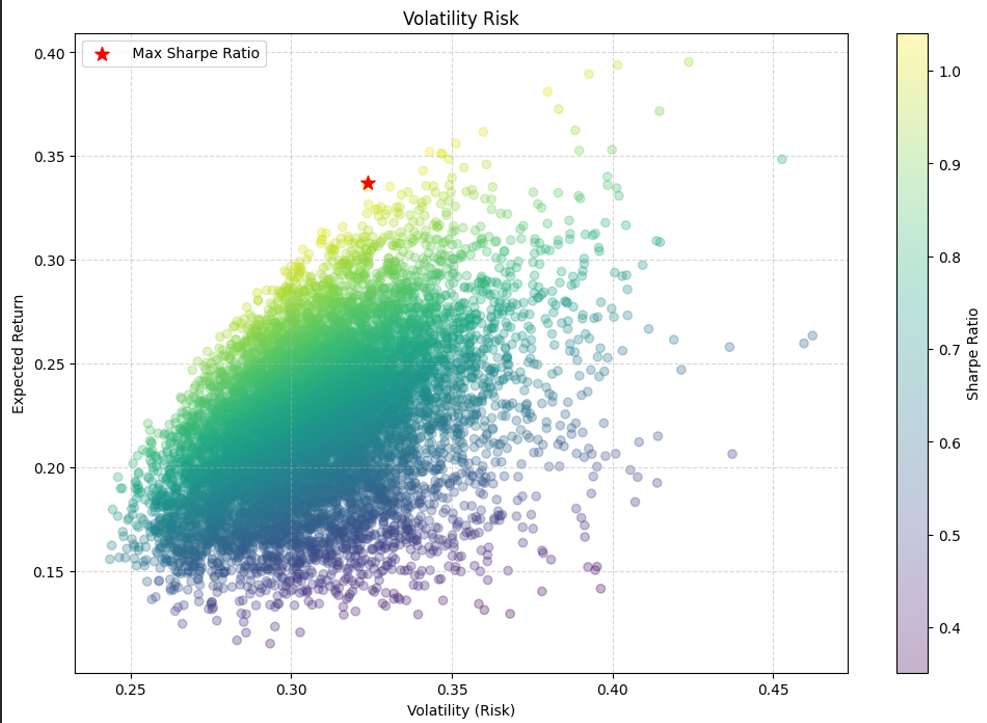

# Quantitative Portfolio Optimizer 📈

A Python-based financial tool that constructs an optimal investment portfolio using **Modern Portfolio Theory (MPT)**. The engine downloads historical stock data, simulates 10,000 random portfolio allocations using **Monte Carlo methods**, and identifies the mathematically optimal weightings to maximize the **Sharpe Ratio**.


*(Above: The "Efficient Frontier" generated by the simulation. The Red Star indicates the Maximum Sharpe Ratio portfolio.)*

## 🚀 Key Features
* **Automated Data Pipeline:** Fetches 5 years of historical adjusted close prices using the `yfinance` API.
* **Statistical Analysis:** Calculates Log Returns, Annualized Volatility, and Covariance Matrices.
* **Monte Carlo Simulation:** Simulates 10,000 unique portfolio combinations to visualize risk-return trade-offs.
* **Optimization:** Algorithmic identification of the specific asset weights that yield the highest risk-adjusted return.

## 🛠️ Tech Stack
* **Python 3.x**
* **Pandas:** Time-series data handling and cleaning.
* **NumPy:** Vectorized matrix operations (Covariance & Dot Products).
* **Matplotlib:** Data visualization (Scatter plots & Color mapping).
* **Yfinance:** Yahoo Finance market data scraper.

## 📊 How It Works
1.  **Data Extraction:** The script downloads daily price data for a user-defined list of tickers (e.g., AAPL, TSLA, MSFT).
2.  **Metric Calculation:**
    * *Annual Return* = Mean Daily Log Return × 252
    * *Annual Risk* = $\sqrt{w^T \cdot \Sigma \cdot w} \times \sqrt{252}$
3.  **Simulation:** The model randomly assigns weights ($w$) to assets and plots the resulting Return vs. Volatility.
4.  **Output:** Returns a specific allocation strategy (e.g., "30% Apple, 70% Tesla") that maximizes the Sharpe Ratio.

## 💻 How to Run This Project
1.  **Clone the repository:**
    ```bash
    git clone https://github.com/arpanjangra/quantitative_portfolio_optimizer.git
    ```
2.  **Install dependencies:**
    ```bash
    pip install pandas numpy yfinance matplotlib
    ```
3.  **Run the script:**
    ```bash
    python portfolio_manager.ipynb
    ```

## 📈 Sample Results
* **Tickers Analyzed:** AAPL, MSFT, GOOG, AMZN, TSLA (5-Year Period)
* **Optimal Sharpe Ratio:** 1.52
* **Suggested Allocation:**
    * Google (GOOG): 51.63%
    * Nvidia (NVDA): 34.53%
    * Apple (AAPL): 7.05%
    * Amazon (AMZN): 3.21%
    * Microsoft (MSFT): 3.42%
    * Tesla (TSLA): 0.16%

## 🔮 Future Improvements
* Add **SciPy** optimization (`minimize` function) to find the exact efficient frontier boundary without random simulation.
* Implement **Value at Risk (VaR)** calculation.
* Build a **Streamlit** dashboard for interactive user input.

---
*Created by Arpan*
