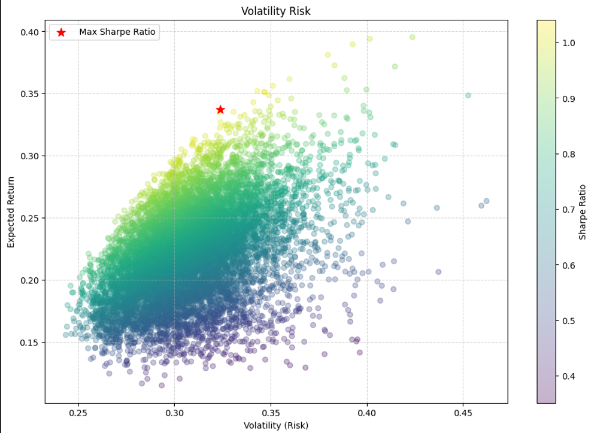

# Quantitative Portfolio Optimizer

A Python-based financial research tool that builds an optimal investment portfolio using **Modern Portfolio Theory (MPT)**, then stress-tests that "optimal" answer to show how much it depends on estimation noise in the inputs.

The project has two parts:

1. **Monte Carlo portfolio optimization** — downloads historical stock data, simulates 10,000 random portfolio allocations, and identifies the weightings that maximize the Sharpe Ratio.
2. **Estimation-error analysis** — treats the mean-return and covariance inputs as what they actually are (MLE point estimates from a finite sample), builds bootstrap confidence intervals around them, and re-runs the optimizer on thousands of resamples to show how unstable the "optimal" weights really are. This motivates a follow-up **Black-Litterman** implementation.

[](efficient_frontier_plot.png)
*(Above: The "Efficient Frontier" generated by the Monte Carlo simulation. The Red Star indicates the Maximum Sharpe Ratio portfolio.)*

## Key Features

- **Automated Data Pipeline:** Fetches historical adjusted close prices via the `yfinance` API and caches them locally as CSV.
- **Statistical Analysis:** Computes log returns, annualized expected returns, volatility, and the covariance matrix.
- **Monte Carlo Simulation:** Simulates 10,000 random portfolio combinations to visualize the risk-return trade-off (the efficient frontier).
- **Exact Optimization (SLSQP):** Solves for the exact max-Sharpe (tangency) portfolio with `scipy.optimize`, long-only and fully invested, as a cross-check on the Monte Carlo search.
- **MLE Estimation:** Re-derives the mean vector and covariance matrix explicitly as maximum-likelihood estimates.
- **Bootstrap Confidence Intervals:** Nonparametric bootstrap (2,000 resamples) around expected returns and volatilities, with no normality assumption.
- **Weight Instability Analysis:** Re-runs the max-Sharpe optimizer on every bootstrap resample to show how much the "optimal" allocation swings from sampling noise alone — and decomposes that instability into the contribution from mean-return noise vs. covariance noise.

## Tech Stack

- **Python 3.x**
- **Pandas:** Time-series data handling and cleaning.
- **NumPy:** Vectorized matrix operations (covariance, dot products, bootstrap resampling).
- **SciPy (`scipy.optimize`):** Exact constrained optimization (SLSQP) for the max-Sharpe portfolio.
- **Matplotlib:** Data visualization (scatter plots, box plots, error bars, color mapping).
- **yfinance:** Yahoo Finance market data.

## How It Works

### Part 1 — Monte Carlo Optimization

1. **Data Extraction:** Downloads daily adjusted close prices for a user-defined list of tickers (e.g. `AAPL`, `MSFT`, `GOOG`, `AMZN`, `TSLA`, `NVDA`) over a 5-year period, and caches them to `stock_prices.csv`.
2. **Metric Calculation:**
   - *Annualized Return* = mean daily log return × 252
   - *Annualized Risk* = $\sqrt{w^T \Sigma w}$, using the annualized covariance matrix $\Sigma$
   - *Sharpe Ratio* = Return / Risk (risk-free rate assumed to be 0)
3. **Simulation:** Draws 10,000 random long-only weight vectors (normalized to sum to 1), computes return/volatility/Sharpe for each, and plots the resulting cloud of portfolios.
4. **Output:** Reports the allocation with the highest simulated Sharpe Ratio, and marks it on the efficient frontier plot.

### Part 2 — How Wrong Could the Inputs Be?

Part 1 treats `mean_returns` and `cov_matrix` as if they were the true parameters. In reality they are **MLE point estimates from a finite sample** (~5 years of daily returns) and carry real sampling error. Part 2 quantifies that error and propagates it through the optimizer:

1. **MLE re-derivation (2.1–2.2):** Recomputes $\hat\mu$ and $\hat\Sigma$ explicitly as maximum-likelihood estimates and cross-checks them against Part 1's numbers. (Note: the MLE covariance divides by $T$, not $T-1$ like pandas' default `.cov()` — the mean is identical either way, only the covariance differs slightly.)
2. **Bootstrap confidence intervals (2.3):** Resamples the daily return history with replacement 2,000 times, recomputes $\hat\mu, \hat\Sigma$ on each resample, and builds empirical 95% CIs for expected returns and volatilities. Typically, return estimates turn out to be far noisier (wide CIs) than volatility estimates (tight CIs) from the same sample.
3. **Exact optimizer cross-check (2.4):** Solves for the exact max-Sharpe portfolio via SLSQP as a sanity check against the Monte Carlo search from Part 1.
4. **Weight instability (2.5):** Re-runs the identical max-Sharpe optimizer on all 2,000 bootstrap $(\hat\mu_b, \hat\Sigma_b)$ pairs and plots the resulting distribution of "optimal" weights per asset. If MVO were robust to estimation noise, these would cluster tightly — in practice they swing substantially, purely from resampling the same 6-asset history.
5. **Noise decomposition (2.6):** Repeats the exercise holding $\Sigma$ fixed (perturbing only $\mu$) and holding $\mu$ fixed (perturbing only $\Sigma$), to isolate which input is actually driving the weight instability. The result: **mean-return estimation error, not covariance error, is the dominant source of instability.**
6. **Takeaways (2.7):** Because mean-variance optimization amplifies noise in the least-reliably-estimated input (expected returns), the natural next step is **Black-Litterman** — instead of feeding a noisy sample mean straight into the optimizer, BL starts from a stable market-equilibrium prior (via reverse optimization on market-cap weights) and blends in investor views weighted by their own uncertainty, shrinking the input rather than amplifying its noise.

## Sample Results

Six-ticker universe (`AAPL`, `MSFT`, `GOOG`, `AMZN`, `TSLA`, `NVDA`), 5-year period, 10,000 Monte Carlo simulations:

| Ticker | Allocation |
|--------|-----------:|
| AAPL   | 23.00%     |
| AMZN   | 7.25%      |
| GOOG   | 16.21%     |
| MSFT   | 3.04%      |
| NVDA   | 49.91%     |
| TSLA   | 0.59%      |

- **Expected Return:** 30.31%
- **Annual Risk:** 34.88%
- **Sharpe Ratio:** 86.89%

Part 2's bootstrap analysis on this same universe shows these weights are **not as stable as the point estimate suggests** — see the weight-instability box plots generated by the notebook (`weight_instability_boxplot_real.png`, `weight_instability_decomposed_real.png`) for the actual spread across resamples.

## Getting Started

```bash
pip install pandas numpy scipy matplotlib yfinance
```

Open `portfolio_manager.ipynb` (or `Portfolio_optimiser_extended.ipynb` for the full Part 1 + Part 2 analysis) in Jupyter and run all cells top to bottom. The notebook will download and cache price data on first run (`stock_prices.csv`), then reuse the cached file on subsequent runs.

## 🔮 Future Improvements

- Implement **Black-Litterman** on the same 6-ticker set: feed the BL posterior `mu`/`cov` into the existing `max_sharpe_weights()` optimizer and re-run the Section 2.5 bootstrap exercise to show BL weights are materially more stable than the raw MVO weights above.
- Implement **Value at Risk (VaR)** calculation.
- Build a **Streamlit** dashboard for interactive user input.

---

*Created by Arpan*
